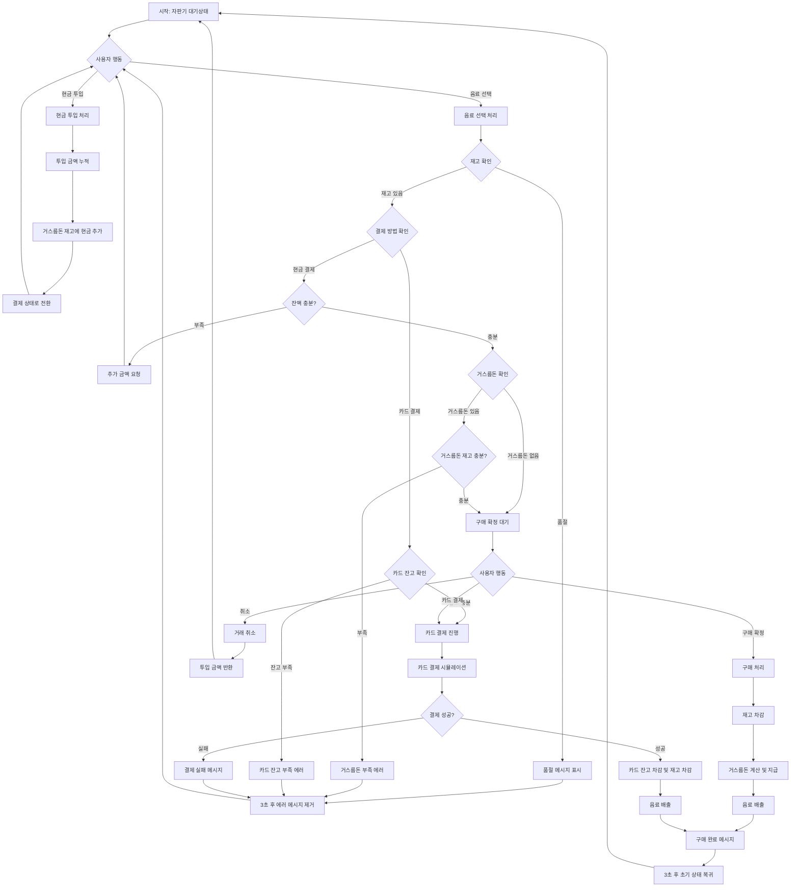

# 자판기 시뮬레이터 - 메카니즘 다이어그램

## 개요

이 문서는 자판기에서 사용자가 원하는 음료수를 얻기까지의 전체 메카니즘을 설명합니다.

## 자판기 동작 플로우차트



## 주요 상태 (State)

### 거래 상태 (Transaction Status)

- **idle**: 대기 상태 - 사용자 입력 대기
- **payment**: 결제 진행 중 - 현금이 투입된 상태
- **selection**: 음료 선택 완료 - 구매 방법 선택 대기
- **processing**: 구매 처리 중 - 실제 거래 진행
- **complete**: 구매 완료 - 성공적으로 음료 구매
- **error**: 오류 발생 - 각종 예외 상황

### 결제 방법 (Payment Method)

- **cash**: 현금 결제
- **card**: 카드 결제
- **null**: 결제 방법 미선택

## 핵심 로직

### 1. 현금 투입 로직

```typescript
// 현금 투입 시 처리 과정
insertCash(denomination) {
  - 현재 상태가 idle 또는 payment인지 확인
  - 투입 금액을 누적
  - 거스름돈 재고에 투입된 현금 추가
  - 결제 상태로 변경
}
```

### 2. 음료 선택 로직

```typescript
selectDrink(drink) {
  - 재고 확인 (품절 체크)
  - 현금 결제 시:
    - 잔액 충분성 확인
    - 거스름돈 계산 및 재고 확인
  - 선택 상태로 변경
}
```

### 3. 거스름돈 계산 로직 (탐욕 알고리즘)

```typescript
calculateChange(amount, inventory) {
  - 큰 액면가부터 순서대로 처리
  - 각 액면가별로 필요한 개수와 재고 비교
  - 최소 개수로 거스름돈 조합 계산
  - 정확한 거스름돈 지급 가능 여부 반환
}
```

## 예외 상황 처리

### 1. 품절 상황

- 재고가 0인 음료 선택 시 품절 메시지 표시
- 3초 후 자동으로 메시지 제거

### 2. 잔액 부족

- 투입 금액이 음료 가격보다 적을 때
- 필요한 추가 금액을 사용자에게 안내

### 3. 거스름돈 부족

- 자판기 내 거스름돈 재고로 정확한 거스름돈 지급 불가능
- 다른 음료 선택 또는 정확한 금액 투입 요청

### 4. 카드 잔고 부족

- 카드 잔고가 음료 가격보다 적을 때
- 현재 잔고와 필요 금액을 표시하고 카드 충전 안내

### 5. 카드 결제 실패

- 15% 확률로 카드 결제 실패 시뮬레이션
- 실패 시 에러 메시지 표시 후 재시도 가능

### 6. 거래 취소

- 언제든지 거래 취소 가능
- 투입된 현금 반환 처리

## 데이터 구조

### 음료 정보 (Drink)

```typescript
{
  id: string; // 음료 고유 ID
  name: string; // 음료 이름
  price: number; // 가격
  stock: number; // 재고 수량
}
```

### 거래 정보 (Transaction)

```typescript
{
  selectedDrink: Drink | null;     // 선택된 음료
  insertedAmount: number;          // 투입된 금액
  paymentMethod: PaymentMethod;    // 결제 방법
  status: TransactionStatus;       // 현재 상태
  errorMessage?: string;           // 에러 메시지
}
```

### 자판기 상태 (VendingMachineState)

```typescript
{
  drinks: Drink[];                           // 음료 목록
  transaction: Transaction;                  // 현재 거래 정보
  changeInventory: Record<number, number>;   // 거스름돈 재고
  cardBalance: number;                       // 카드 잔고 (시뮬레이션용)
}
```

## 성능 최적화

1. **useCallback**: 함수 재생성 방지로 리렌더링 최소화
2. **배치 상태 업데이트**: setState 호출 최소화
3. **타이머 정리**: useEffect cleanup으로 메모리 누수 방지
4. **탐욕 알고리즘**: 거스름돈 계산 최적화

## 접근성 고려사항

1. **키보드 내비게이션**: 모든 버튼에 키보드 접근 가능
2. **스크린 리더**: 적절한 라벨링
3. **색상 대비**: WCAG 가이드라인 준수
4. **포커스 표시**: 명확한 포커스 상태 표시
